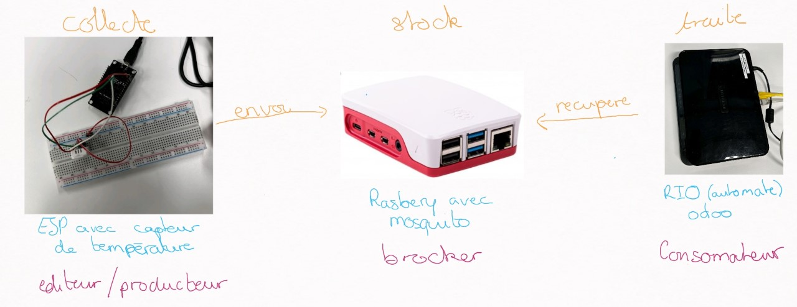

# ESIEA-grp6

## Enoncer :
Le sujet du 23/01/2023 : 
1. installer votre esp8266
2. récupérer la température et l'afficher dans les logs
3. se connecter au wifi
4. installer moskito grâce à ancibel pour faire un playbook sur la rasberry

5. envoyer des données au format JSON  
    Format topic ESIEA/grp6  
    Data {  
        "temperature" : "xx"  
        "humidity" : "xx"  
    }  

## Rendu:
- Sur github
- Code Ardouino
- Playbook Ansible
- ScreenShots
